---
## Front matter
title: "Отчёт по лабораторной работе №6"
subtitle: "Дисциплина: Архитектура компьютера"
author: "Буриева Шахзода Акмаловна"

## Generic otions
lang: ru-RU
toc-title: "Содержание"

## Bibliography
bibliography: bib/cite.bib
csl: pandoc/csl/gost-r-7-0-5-2008-numeric.csl

## Pdf output format
toc: true # Table of contents
toc-depth: 2
lof: true # List of figures
lot: true # List of tables
fontsize: 12pt
linestretch: 1.5
papersize: a4
documentclass: scrreprt
## I18n polyglossia
polyglossia-lang:
  name: russian
  options:
	- spelling=modern
	- babelshorthands=true
polyglossia-otherlangs:
  name: english
## I18n babel
babel-lang: russian
babel-otherlangs: english
## Fonts
mainfont: PT Serif
romanfont: PT Serif
sansfont: PT Sans
monofont: PT Mono
mainfontoptions: Ligatures=TeX
romanfontoptions: Ligatures=TeX
sansfontoptions: Ligatures=TeX,Scale=MatchLowercase
monofontoptions: Scale=MatchLowercase,Scale=0.9
## Biblatex
biblatex: true
biblio-style: "gost-numeric"
biblatexoptions:
  - parentracker=true
  - backend=biber
  - hyperref=auto
  - language=auto
  - autolang=other*
  - citestyle=gost-numeric
## Pandoc-crossref LaTeX customization
figureTitle: "Рис."
tableTitle: "Таблица"
listingTitle: "Листинг"
lofTitle: "Список иллюстраций"
lotTitle: "Список таблиц"
lolTitle: "Листинги"
## Misc options
indent: true
header-includes:
  - \usepackage{indentfirst}
  - \usepackage{float} # keep figures where there are in the text
  - \floatplacement{figure}{H} # keep figures where there are in the text
---

# Цель работы

Приобретение практических навыков взаимодействия пользователя с системой посредством командной строки.

# Выполнение лабораторной работы

Определила полное имя вашего домашнего каталога.

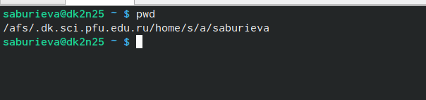{ #fig:001 width=70% }

Перешла в каталог /tmp и вывела на экран содержимое каталога /tmp. Для этого использовала команду ls
с различными опциями.

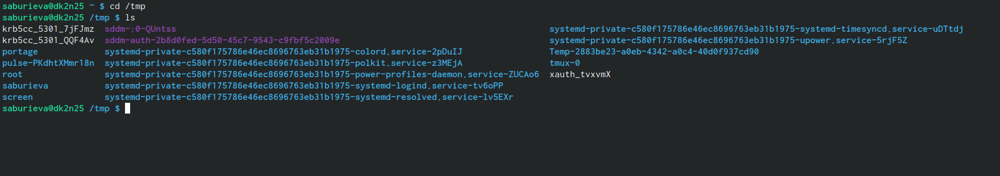{ #fig:001 width=70% }

Определила, есть ли в каталоге /var/spool подкаталог с именем cron(его там нет).

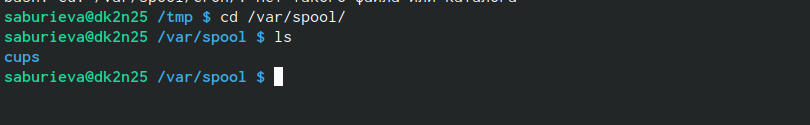{ #fig:001 width=70% }

Перешла в домашний каталог и вывела на экран его содержимое.

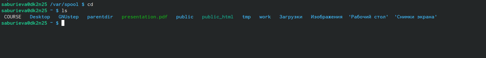{ #fig:001 width=70% }

В домашнем каталоге создала новый каталог с именем newdir и в каталоге ~/newdir создала новый каталог с именем morefun.

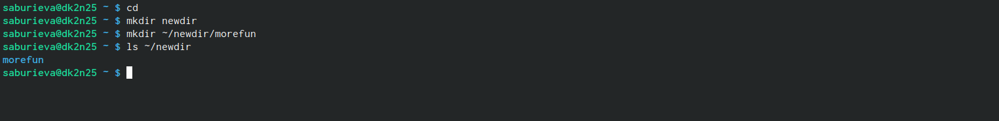{ #fig:001 width=70% }

В домашнем каталоге создала одной командой три новых каталога с именами
letters, memos, misk и проверила,создались ли они.

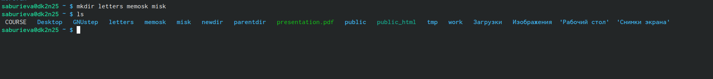{ #fig:001 width=70% }

Далее удалила эти каталоги одной командой rm.

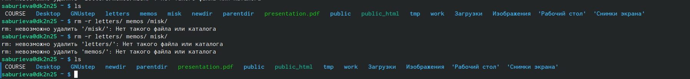{ #fig:001 width=70% }

Удалила каталог ~/newdir/morefun из домашнего каталога. Проверила, был ли
каталог удалён.

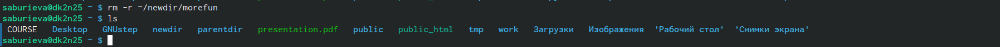{ #fig:001 width=70% }

С помощью команды man определила, какую опцию команды ls нужно использо-
вать для просмотра содержимое не только указанного каталога, но и подкаталогов,
входящих в него.

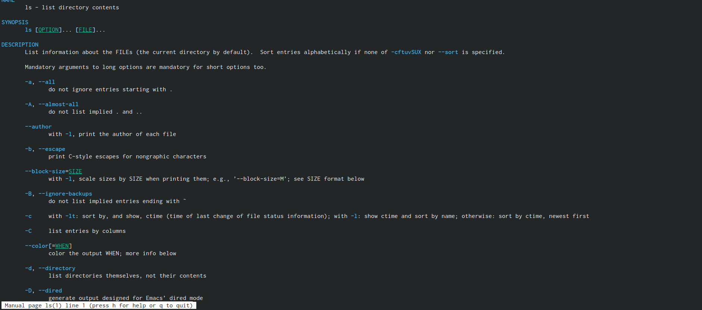{ #fig:001 width=70% }

Использовала команду man для просмотра описания следующих команд: cd, pwd, mkdir,
rmdir, rm.

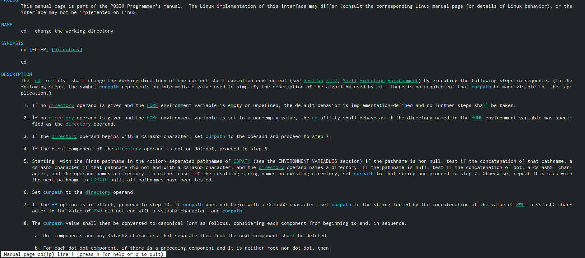{ #fig:001 width=70% }

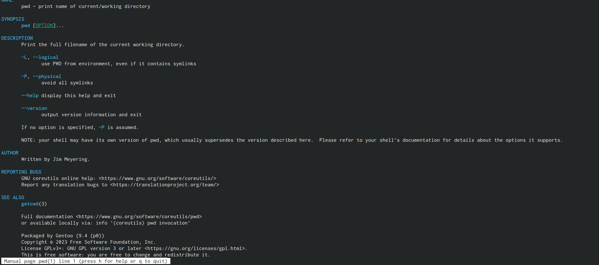{ #fig:001 width=70% }

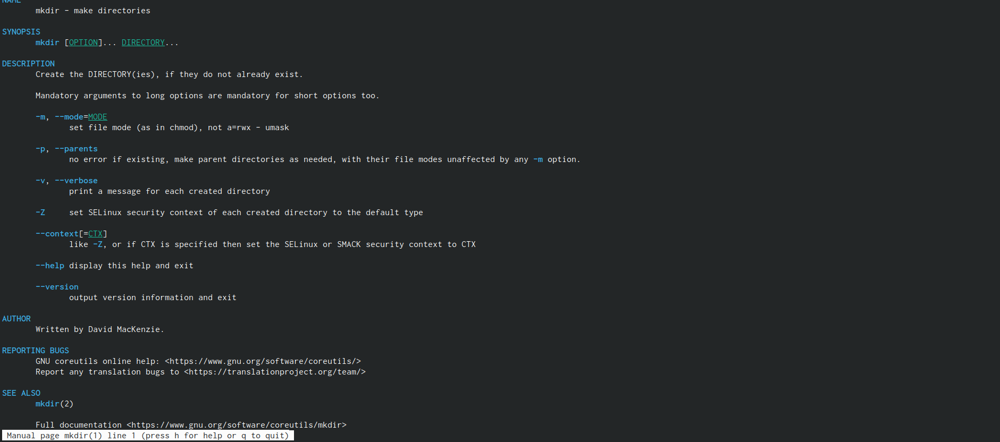{ #fig:001 width=70% }

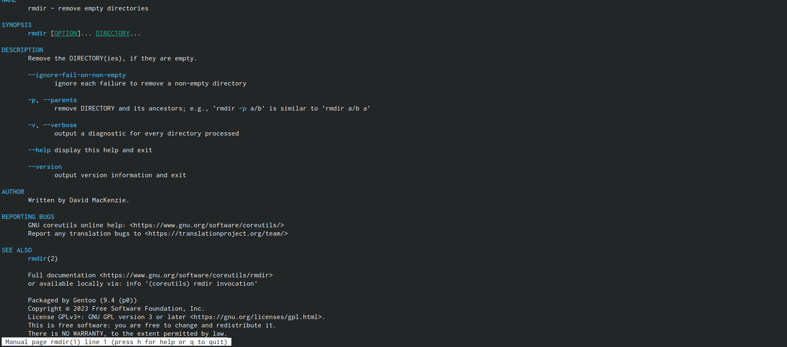{ #fig:001 width=70% }

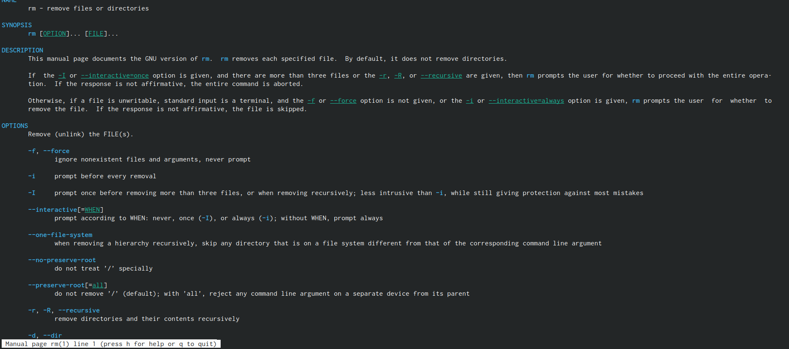{ #fig:001 width=70% }

Используя информацию, полученную при помощи команды history, выполнила модификацию и исполнение нескольких команд из буфера команд.

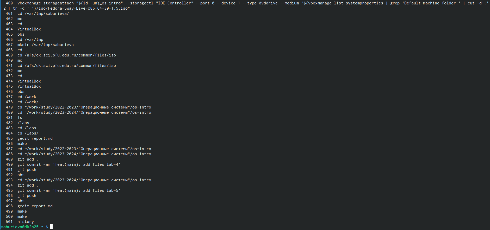{ #fig:001 width=70% }

# Вывод

Приобрела практические навыки взаимодействия пользователя с системой посредством командной строки.

# Список литературы{.unnumbered}

::: {#refs}
:::
