---
## Front matter
title: "Отчёт по лабораторной работе №7"
subtitle: "Дисциплина: Архитектура компьютера"
author: "Буриева Шахзода Акмаловна"

## Generic otions
lang: ru-RU
toc-title: "Содержание"

## Bibliography
bibliography: bib/cite.bib
csl: pandoc/csl/gost-r-7-0-5-2008-numeric.csl

## Pdf output format
toc: true # Table of contents
toc-depth: 2
lof: true # List of figures
lot: true # List of tables
fontsize: 12pt
linestretch: 1.5
papersize: a4
documentclass: scrreprt
## I18n polyglossia
polyglossia-lang:
  name: russian
  options:
	- spelling=modern
	- babelshorthands=true
polyglossia-otherlangs:
  name: english
## I18n babel
babel-lang: russian
babel-otherlangs: english
## Fonts
mainfont: PT Serif
romanfont: PT Serif
sansfont: PT Sans
monofont: PT Mono
mainfontoptions: Ligatures=TeX
romanfontoptions: Ligatures=TeX
sansfontoptions: Ligatures=TeX,Scale=MatchLowercase
monofontoptions: Scale=MatchLowercase,Scale=0.9
## Biblatex
biblatex: true
biblio-style: "gost-numeric"
biblatexoptions:
  - parentracker=true
  - backend=biber
  - hyperref=auto
  - language=auto
  - autolang=other*
  - citestyle=gost-numeric
## Pandoc-crossref LaTeX customization
figureTitle: "Рис."
tableTitle: "Таблица"
listingTitle: "Листинг"
lofTitle: "Список иллюстраций"
lotTitle: "Список таблиц"
lolTitle: "Листинги"
## Misc options
indent: true
header-includes:
  - \usepackage{indentfirst}
  - \usepackage{float} # keep figures where there are in the text
  - \floatplacement{figure}{H} # keep figures where there are in the text
---

# Цель работы

Ознакомление с файловой системой Linux, её структурой, именами и содержанием
каталогов. Приобретение практических навыков по применению команд для работы
с файлами и каталогами, по управлению процессами (и работами), по проверке исполь-
зования диска и обслуживанию файловой системы.

# Выполнение лабораторной работы

Выполнила все примеры, приведённые в первой части описания лабораторной работы,а именно:

1. Скопировала файл ~/abc1 в файл april и в файл may.

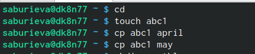{ #fig:001 width=70% }

2. Скопировала файлы april и may в каталог monthly.

{ #fig:001 width=70% }

3. Скопировала файл monthly/may в файл с именем june.

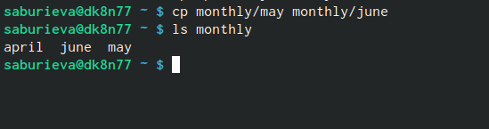{ #fig:001 width=70% }

4. Скопировала каталог monthly в каталог monthly.00.

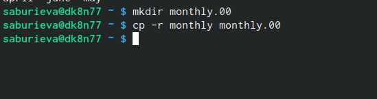{ #fig:001 width=70% }

5. Скопировала каталог monthly.00 в каталог /tmp.

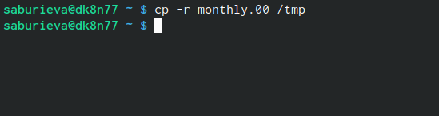{ #fig:001 width=70% }

6. Изменила название файла april на july в домашнем каталоге.

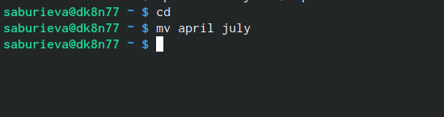{ #fig:001 width=70% }

7. Переместила файл july в каталог monthly.00.

{ #fig:001 width=70% }

8. Переименовала каталог monthly.00 в monthly.01.

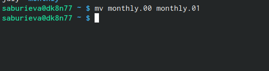{ #fig:001 width=70% }

9. Переместила каталог monthly.01в каталог reports.

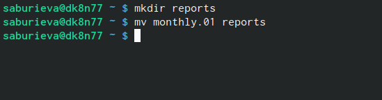{ #fig:001 width=70% }

10. Переименовала каталог reports/monthly.01 в reports/monthly.

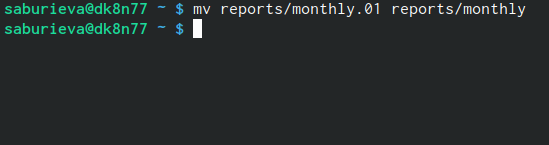{ #fig:001 width=70% }

11. Изменила права доступа.

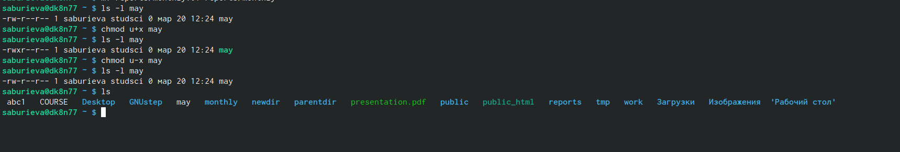{ #fig:001 width=70% }

Далее выполнила следующие действия, зафиксировав в отчёте по лабораторной работе
используемые при этом команды и результаты их выполнения:

1. Скопировала файл /usr/include/sys/io.h в домашний каталог и назвала его
equipment.Файла io.h нет, поэтому использовала любой другой файл в каталоге
/usr/include/sys/ вместо него.

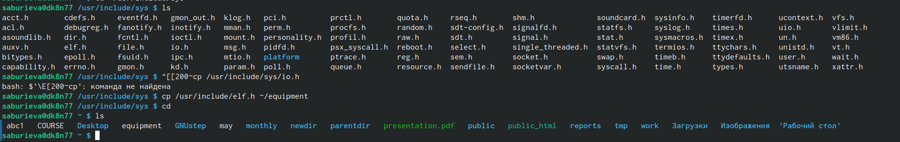{ #fig:001 width=70% }

2. В домашнем каталоге создала директорию ~/ski.places.

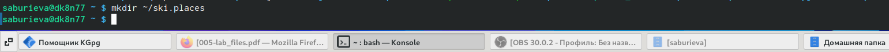{ #fig:001 width=70% }

3. Переместила файл equipment в каталог ~/ski.places.

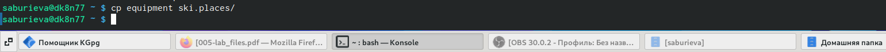{ #fig:001 width=70% }

4. Переименовала файл ~/ski.places/equipment в ~/ski.places/equiplist.

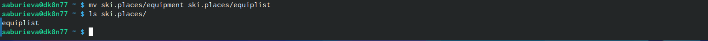{ #fig:001 width=70% }

5. Создала в домашнем каталоге файл abc1 и скопировала его в каталог
~/ski.places, назовите его equiplist2.

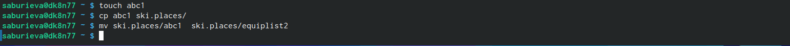{ #fig:001 width=70% }

6. Создала каталог с именем equipment в каталоге ~/ski.places.

{ #fig:001 width=70% }

7. Переместила файлы ~/ski.places/equiplist и equiplist2 в каталог
~/ski.plases/equipment.

{ #fig:001 width=70% }

Далее определила опции команды chmod, необходимые для того, чтобы присвоить перечисленным ниже файлам выделенные права доступа. При необходимости создала нужные файлы.

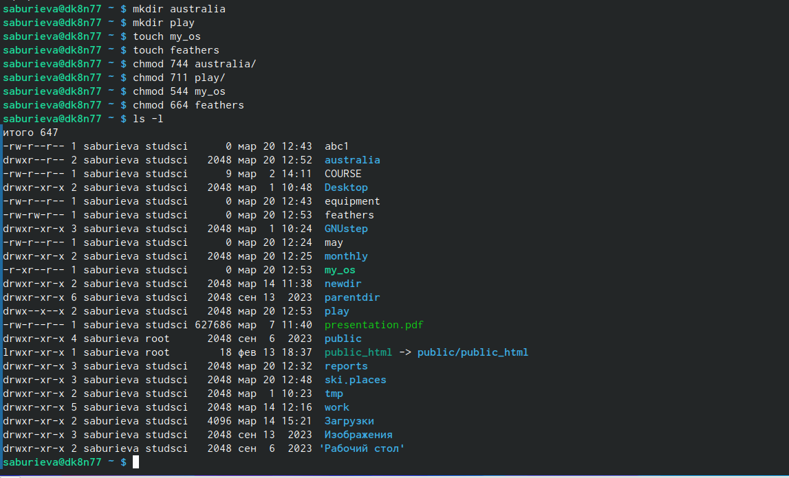{ #fig:001 width=70% }

Проделала приведённые ниже упражнения, записывая в отчёт по лабораторной работе используемые при этом команды:

1. Просмотрела содержимое файла /etc/password.

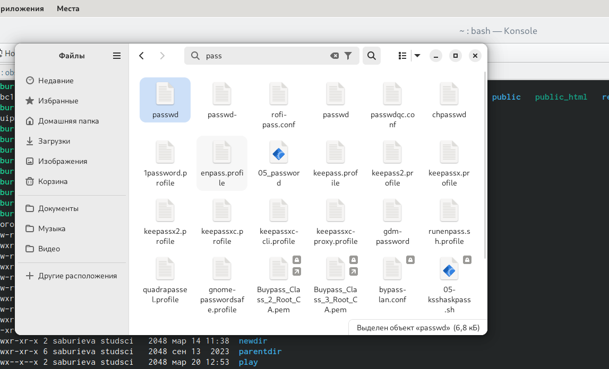{ #fig:001 width=70% }

2. Скопировала файл ~/feathers в файл ~/file.old.

{ #fig:001 width=70% }

3. Переместила каталог ~/fun в каталог ~/play.

{ #fig:001 width=70% }

Прочтем мануалы по mount, fsck, mkfs, kill

1. mount для подключения дисков
2. fsck для восстановления файловой системы
3. mkfs для создания файловой системы
4. kill для отправки сигнала на процесс

# Ответы на контрольные вопросы 

1)На жестком диске компьютера, на котором я выполняла лабораторную работу, были установлены следующие файловые системы: ext4, swap и vfat. ext4 - это распространенная файловая система для Linux, vfat - файловая система для устройств с файловыми системами FAT32 и FAT16.

2)Общая структура файловой системы Linux: корневой каталог (/), каталоги исполняемых файлов (/bin), конфигурационные файлы (/etc), домашние каталоги пользователей (/home), временные файлы (/tmp), системные файлы (/sys) и устройства (/dev).

3)Необходимо произвести монтирование файловой системы.

4) Основные причины нарушения целостности файловой системы: сбои в питании, неправильное завершение работы, ошибки в работе программного обеспечения. Повреждения файловой системы могут быть устранены с помощью специализированных инструментов, таких как fsck.

5)Файловая система создается с помощью утилиты mkfs, которая форматирует блочное устройство, подготавливая его для использования.

6)Основные команды для просмотра текстовых файлов: cat (вывод содержимого файла в терминал), less (постраничный просмотр содержимого файла), head (вывод первых строк файла), tail (вывод последних строк файла).

7)Основные возможности команды cp в Linux: копирование файлов и директорий, рекурсивное копирование содержимого директории, переименование файлов и директорий, установка разрешений на файлы и директории при копировании.

# Выводы

Ознакомились с файловой системой Linux, её структурой, именами и содержанием каталогов. Приобрели практические навыки по применению команд для работы с файлами и каталогами, по управлению процессами (и работами), по проверке использования диска и обслуживанию файловой системы. 

# Список литературы{.unnumbered}
