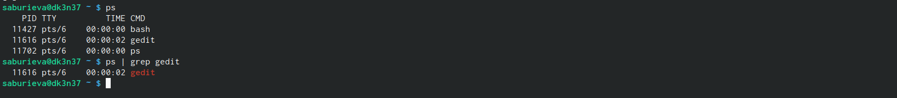

---
## Front matter
title: "Отчёт по лабораторной работе №8"
subtitle: "Дисциплина: Архитектура компьютера"
author: "Буриева Шахзода Акмаловна"

## Generic otions
lang: ru-RU
toc-title: "Содержание"

## Bibliography
bibliography: bib/cite.bib
csl: pandoc/csl/gost-r-7-0-5-2008-numeric.csl

## Pdf output format
toc: true # Table of contents
toc-depth: 2
lof: true # List of figures
lot: true # List of tables
fontsize: 12pt
linestretch: 1.5
papersize: a4
documentclass: scrreprt
## I18n polyglossia
polyglossia-lang:
  name: russian
  options:
	- spelling=modern
	- babelshorthands=true
polyglossia-otherlangs:
  name: english
## I18n babel
babel-lang: russian
babel-otherlangs: english
## Fonts
mainfont: PT Serif
romanfont: PT Serif
sansfont: PT Sans
monofont: PT Mono
mainfontoptions: Ligatures=TeX
romanfontoptions: Ligatures=TeX
sansfontoptions: Ligatures=TeX,Scale=MatchLowercase
monofontoptions: Scale=MatchLowercase,Scale=0.9
## Biblatex
biblatex: true
biblio-style: "gost-numeric"
biblatexoptions:
  - parentracker=true
  - backend=biber
  - hyperref=auto
  - language=auto
  - autolang=other*
  - citestyle=gost-numeric
## Pandoc-crossref LaTeX customization
figureTitle: "Рис."
tableTitle: "Таблица"
listingTitle: "Листинг"
lofTitle: "Список иллюстраций"
lotTitle: "Список таблиц"
lolTitle: "Листинги"
## Misc options
indent: true
header-includes:
  - \usepackage{indentfirst}
  - \usepackage{float} # keep figures where there are in the text
  - \floatplacement{figure}{H} # keep figures where there are in the text
---

# Цель работы

Ознакомление с инструментами поиска файлов и фильтрации текстовых данных. Приобретение практических навыков: по управлению процессами (и заданиями), по проверке использования диска и обслуживанию файловых систем.

# Выполнение лабораторной работы

Осуществила вход в систему, используя соответствующее имя пользователя. Далее записала в файл file.txt названия файлов, содержащихся в каталоге /etc. Дописала в этот же файл названия файлов, содержащихся в вашем домашнем каталоге.

{ #fig:001 width=70% }

Вывела имена всех файлов из file.txt, имеющих расширение .conf, после чего записала их в новый текстовой файл conf.txt.

{ #fig:001 width=70% }

Определила, какие файлы в моем домашнем каталоге имеют имена, начинавшиеся с символа c, предложила 2 варианта, как это сделать.

{ #fig:001 width=70% }

Вывела на экран (по странично) имена файлов из каталога /etc, начинающиеся с символа h.

{ #fig:001 width=70% }

Запустила в фоновом режиме процесс, который будет записывать в файл ~/logfile файлы, имена которых начинаются с log.

{ #fig:001 width=70% }

Удалила файл ~/logfile/

{ #fig:001 width=70% }

Запустила из консоли в фоновом режиме редактор gedit.

{ #fig:001 width=70% }

Определила идентификатор процесса gedit, используя команду ps, конвейер и фильтр grep.

{ #fig:001 width=70% }

Прочла справку (man) команды kill, после чего использовала её для завершения
процесса gedit.

{ #fig:001 width=70% }

{ #fig:001 width=70% }

Выполнила команды df и du, предварительно получив более подробную информацию
об этих командах, с помощью команды man.

{ #fig:001 width=70% }

{ #fig:001 width=70% }

{ #fig:001 width=70% }

{ #fig:001 width=70% }

Воспользовавшись справкой команды find, вывела имена всех директорий, имеющихся в вашем домашнем каталоге.

{ #fig:001 width=70% }

# Ответы на контрольные вопросы

1)Потоки ввода/вывода используются для передачи данных в файловые потоки, на консоль или на сетевые соединения. Существует два вида потоков ввода/вывода: байтовые и символьные.

2)Оба оператора являются операторами направления вывода. Основное отличие указано ниже:

    > : Перезаписывает существующий файл или создает файл, если файл с указанным именем отсутствует в каталоге.
    >> : добавляет существующий файл или создает файл, если файл с указанным именем отсутствует в каталоге.
    
3)Конвейер — машина непрерывного транспорта, предназначенная для перемещения сыпучих, кусковых или штучных грузов. Конвейерное производство — система поточной организации производства на основе конвейера, при которой оно разделено на простейшие короткие операции, а перемещение деталей осуществляется автоматически.

4)Процесс – это выполнение определенной программы. Это активный объект, выполняющий задачу приложения. Программа — это пассивная сущность. Он хранит группу инструкций, которые необходимо выполнить.

5)На компьютере, настроенном для использования плагина Active Directory Службы каталогов, можно задать атрибут Active Directory, который будет сопоставлен атрибуту уникального ID пользователя (UID), идентификатору группы (GID) и первичному идентификатору группы (PID), в macOS.

# Выводы

Ознакомились с инструментами поиска файлов и фильтрации текстовых данных. Приобрели практические навыки: по управлению процессами (и заданиями), по проверке использования диска и обслуживанию файловых систем.

# Список литературы{.unnumbered}

::: {#refs}
:::
